# Builtins

_Builtins_ in Evy are pre-defined functions and events that allow for
user interaction, graphics, animation, mathematical operations, and
more.

_Functions_ are self-contained blocks of code that perform a specific
task. _Events_ are notifications that are sent to a program when
something happens, such as when a user moves the mouse or presses a
key.

For a more formal definition of the Evy syntax, see the
[Language Specification](spec.md), and for an intuitive understanding
see [syntax by example](syntax_by_example.md).

#### Table of Contents

<!-- gen:toc -->

1. [**Input and Output**](#input-and-output)  
   [print](#print), [read](#read), [cls](#cls), [printf](#printf)
2. [**Types**](#types)  
   [len](#len), [typeof](#typeof)
3. [**Map**](#map)  
   [has](#has), [del](#del)
4. [**Program control**](#program-control)  
   [sleep](#sleep), [exit](#exit), [panic](#panic)
5. [**Conversion**](#conversion)  
   [str2num](#str2num), [str2bool](#str2bool)
6. [**Errors**](#errors)  
   [Panic](#panic-1), [Recoverable Errors](#recoverable-errors)
7. [**String**](#string)  
   [sprint](#sprint), [sprintf](#sprintf), [join](#join), [split](#split), [upper](#upper), [lower](#lower), [index](#index), [startswith](#startswith), [endswith](#endswith), [trim](#trim), [replace](#replace)
8. [**Random**](#random)  
   [rand](#rand), [rand1](#rand1)
9. [**Math**](#math)  
   [min](#min), [max](#max), [floor](#floor), [ceil](#ceil), [round](#round), [pow](#pow), [log](#log), [sqrt](#sqrt), [sin](#sin), [cos](#cos), [atan2](#atan2)
10. [**Graphics**](#graphics)  
    [move](#move), [line](#line), [rect](#rect), [circle](#circle), [color](#color), [colour](#colour), [width](#width), [clear](#clear), [grid](#grid), [gridn](#gridn), [poly](#poly), [ellipse](#ellipse), [stroke](#stroke), [fill](#fill), [dash](#dash), [linecap](#linecap), [text](#text), [font](#font)
11. [**Event Handlers**](#event-handlers)  
    [key](#key), [down](#down), [up](#up), [move](#move-1), [animate](#animate), [input](#input)

<!-- genend:toc -->

## Input and Output

### `print`

`print` prints the arguments given to it to the output area. It separates them by
a single space and outputs a newline character at the end.

#### Example

```evy
print "Hello"
print 2 true "blue"
print "array:" [1 2 3]
print "map:" {name:"Scholl" age:21}
```

Output

```evy:output
Hello
2 true blue
array: [1 2 3]
map: {name:Scholl age:21}
```

#### Reference

    print a:any...

The `print` function prints its arguments to the output area, each
separated by a single space and terminated by a newline character. If
no arguments are provided it only prints the newline character.

The backslash character `\` can be used to represent special characters
in strings. For example, the `\t` escape sequence represents a tab
character, and the `\n` escape sequence represents a newline character.
Quotes in string literals must also be escaped with backslashes,
otherwise they will be interpreted as the end of the string literal.
For example:

```evy
print "Here's a tab: 👉\t👈\nShe said: \"Thank you!\""
```

Output

```evy:output
Here's a tab: 👉	👈
She said: "Thank you!"
```

In a browser environment `print` outputs to the output area. When
running Evy from the command line interface, `print` prints to standard
out.

---

### `read`

`read` reads a line of input from the user and returns it as a
string. The newline character is not included in the returned string.

#### Example

```evy
name := read
print "Hello, "+name+"!"
```

Input

```evy:input
Mary Jackson
```

Output

```evy:output
Hello, Mary Jackson!
```

#### Reference

    read:string

The `read` function returns a string that contains the line of input
that the user entered up until, excluding the newline character. It is
a blocking functions, which means that it will not return until the
user has entered a line of input and pressed the Enter key.

In a browser environment `read` reads from the text input area. When
running Evy from the command line interface, `read` reads from standard
in.

---

### `cls`

`cls` clears the output area of all printed text.

#### Example

```evy
print "Hello"
sleep 1
cls
print "Bye"
```

Output

```evy:output
Bye
```

#### Reference

    cls

The `cls` function clears all text output. In a browser environment
`cls` clears the output area. When running Evy from the command line
interface, `cls` clears the terminal, similar to the Unix `clear` or
Windows `cls` commands.

---

### `printf`

`printf` stands for print formatted.

`printf` prints its arguments to the output area according to a _format_
string. The format string is the first argument, and it
contains _specifiers_. Specifiers start with a percent sign `%`. They
tell the `printf` function how and where to print the remaining
arguments inside the format string. The rest of the format string is
printed to the output area without changes.

Here are some valid specifiers in Evy:

| Specifier | Description                        |
| --------- | ---------------------------------- |
| `%v`      | the argument in its default format |
| `%q`      | a double-quoted string             |
| `%%`      | a percent sign `%`                 |

#### Example

```evy
printf "The tank is 100%% full.\n\n"

weather := "rainy"
printf "It is %v today.\n" weather
rainfall := 10
printf "There will be %vmm of rainfall.\n" rainfall
unicorns := false
printf "There will be unicorns eating lollipops: %v.\n\n" unicorns

quote := "Wow!"
printf "They said: %q\n" quote
printf "Array: %v\n" [1 2 3]
printf "Map: %v\n" {a:1 b:2}
```

Output

```evy:output
The tank is 100% full.

It is rainy today.
There will be 10mm of rainfall.
There will be unicorns eating lollipops: false.

They said: "Wow!"
Array: [1 2 3]
Map: {a:1 b:2}
```

#### Reference

    printf format:string a:any...

The `printf` function prints its arguments to the output area according
to the _format_ string that is the first argument. The _specifiers_
that start with `%` and are contained in the format string are replaced
by the remaining arguments in the given order. For example, the
following code `printf "first: %s, second: %s" "A" "B"` prints `first:
A, second: B`.

Full list of valid specifiers in Evy:

| Specifier | Description                                            |
| --------- | ------------------------------------------------------ |
| `%v`      | the argument in a default format                       |
| `%t`      | the word `true` or `false`                             |
| `%f`      | decimal point (floating-point) number, e.g. 123.456000 |
| `%e`      | scientific notation, e.g. -1.234456e+78                |
| `%s`      | string value                                           |
| `%q`      | a double-quoted string                                 |
| `%%`      | a literal percent sign `%`; consumes no value          |

If the arguments for the `%s`, `%q`, `%f`, `%e`, and `%t` specifiers do
not match the required type, a panic will occur.

The _width_ and _precision_ of a floating-point number can be specified
with the `%f` and `%v` format specifiers.

- Width is the number of characters that will be used to print the
  number. If the width is not specified, it will be calculated based on
  the size of the number. It can be useful for padding and aligned
  output.
- Precision is the number of decimal places that will be displayed. If
  the precision is not specified, it will be set to 6 for `%f`.

Here is a table that shows the different ways to specify the width and
precision of a floating-point number:

| Verb    | Description                      |
| ------- | -------------------------------- |
| `%f`    | default width, default precision |
| `%7f`   | width 7, default precision       |
| `%.2f`  | default width, precision 2       |
| `%7.2f` | width 7, precision 2             |
| `%7.f`  | width 7, precision 0             |

If the width/precision is preceded by a `-`, the value is padded with
spaces on the right rather than the left. If it is preceded by a 0, the
value is padded with leading zeros rather than spaces.

The width, precision and alignment prefix (`-` or `0`) can be used with
all valid specifiers. For example:

```evy
printf "right:  |%7.2f|\n" 1
printf "left:   |%-7.2v|\n" "abcd"
printf "zeropad:|%07.2f|\n" 1.2345
```

Output

```evy:output
right:  |   1.00|
left:   |ab     |
zeropad:|0001.23|
```

## Types

### `len`

`len` returns the number of characters in a string, the number of
elements in an array or the number of key-value pairs in a map.

#### Example

```evy
l := len "abcd"
print "len \"abcd\":" l

l = len [1 2]
print "len [1 2]:" l

l = len {a:3 b:4 c:5}
print "len {a:3 b:4 c:5}:" l
```

Output

```evy:output
len "abcd": 4
len [1 2]: 2
len {a:3 b:4 c:5}: 3
```

#### Reference

    len:num a:any

The `len` function takes a single argument, which can be a string, an
array, or a map. If the argument is a string, `len` returns the number
of characters in the string. If the argument is an array, `len` returns
the number of elements in the array. If the argument is a map, `len`
returns the number of key-value pairs in the map. If the argument is of
any other type, a panic will occur.

---

### `typeof`

`typeof` returns the type of the argument as string value.

#### Example

```evy
a:any
a = "abcd"
t := typeof a
print "typeof \"abcd\":" t

t = typeof {kind:true strong:true}
print "typeof {kind:true strong:true}:" t

t = typeof [[1 2] [3 4]]
print "typeof [[1 2] [3 4]]:" t

t = typeof [1 2 true]
print "typeof [1 2 true]:" t

print "typeof []:" (typeof [])
```

Output

```evy:output
typeof "abcd": string
typeof {kind:true strong:true}: {}bool
typeof [[1 2] [3 4]]: [][]num
typeof [1 2 true]: []any
typeof []: []
```

#### Reference

    typeof:string a:any

The `typeof` function takes a single argument, which can be of any type.
The function returns a string that represents the type of the argument.
The string returned by `typeof` is the same as the type in an Evy
program, for example `num`, `bool`, `string`, `[]num`, `{}[]any`. For
an empty composite literal, `typeof` returns `[]` or `{}` as it can be
matched to any subtype, e.g. `[]` can be passed to a function that
takes an argument of `[]num`, or `[]string`.

## Map

### `has`

`has` returns whether a map has a given key or not.

#### Example

```evy
map := {a:1}
printf "has %v %q: %t\n" map "a" (has map "a")
printf "has %v %q: %t\n" map "X" (has map "X")
```

Output

```evy:output
has {a:1} "a": true
has {a:1} "X": false
```

#### Reference

    has:bool map:{} key:string

The `has` function takes two arguments: a map and a key. It returns true
if the map has the key, and false if the map does not have the key. The
map can be of any value type, such as `{}num` or `{}[]any` and the key
can be any string.

---

### `del`

`del` deletes a key-value entry from a map.

#### Example

```evy
map := {a:1 b:2}
del map "b"
print map
```

Output

```evy:output
{a:1}
```

#### Reference

    del map:{} key:string

The `del` function takes two arguments: a map and a key. It deletes the
key-value entry from the map if the key exists. If the key does not
exist, the function does nothing. The map can have any value type, and
the key can be any string. It is safe to delete values from the map
with `del` while iterating with a `for … range` loop.

## Program control

### `sleep`

`sleep` pauses the program for the given number of seconds.

`sleep` can be used to create delays in Evy programs. For example, you
could use sleep to create a countdown timer.

#### Example

```evy
print "2"
sleep 1
print "1"
```

Output

```evy:output
2
1
```

#### Reference

    sleep seconds:num

The `sleep` function pauses the execution of the current Evy program for
at least the given number of seconds. Sleep may also pause for a
fraction of a second, e.g. `sleep 0.1`.

---

### `exit`

`exit` terminates the program with the given status code.

#### Example

```evy expect_err
input := "not a number"
n := str2num input

if err
    print errmsg
    exit 1
end

print n
```

Output

```evy:output
str2num: cannot parse "not a number"
```

---

### `panic`

`panic` prints the given error message and terminates the program
immediately. It is used to report unrecoverable errors.

#### Example

```evy exepect_err
scale := -5

if (scale) <= 0
    panic "scale must be positive"
end
```

Output

```evy:output
line 4 column 5: scale must be positive
```

#### Reference

    panic msg:string

The `panic` function takes a single argument, which is the error message
that the program will print before it terminates with exit status 1.

## Conversion

### `str2num`

`str2num` converts a string to a number. If the string is not a valid
number, it returns `0` and sets the global `err` variable to `true`.

#### Example

```evy
n:num
n = str2num "1"
print "n:" n "err:" err
n = str2num "NOT-A-NUMBER"
print "n:" n "err:" err
```

Output

```evy:output
n: 1 err: false
n: 0 err: true
```

#### Reference

    str2num:num s:string

The `str2num` function converts a string to a number. It takes a single
argument, which is the string to convert. If the string is a valid
number, the function returns the number. Otherwise, the function
returns 0 and sets the global `err` variable to `true`. For more
information on `err`, see the [Recoverable Errors section](#recoverable-errors).

---

### `str2bool`

`str2bool` converts a string to a boolean. If the string is not a valid
boolean, it returns `false` and sets the global `err` variable to
`true`.

#### Example

```evy
b:bool
b = str2bool "true"
print "b:" b "err:" err
b = str2bool "NOT-A-BOOL"
print "b:" b "err:" err
```

Output

```evy:output
b: true err: false
b: false err: true
```

#### Reference

    str2bool:bool s:string

The `str2bool` function converts a string to a bool. It takes a single
argument, which is the string to convert. The function returns `true`
if the string is equal to `"true"`, `"True"`, `"TRUE"`, or `"1"`, and
`false` if the string is equal to `"false"`, `"False"`, `"FALSE"`, or
`"0"`. The function returns `false` and sets the global `err` variable
to `true` if the string is not a valid boolean. For more information
on `err`, see the [Recoverable Errors section](#recoverable-errors).

## Errors

Evy has two types of errors: compiler errors and run-time errors.

- _Compiler errors_ are reported before the program is executed. They
  report errors with the syntax, such as a missing closing quote for
  `print "abc`, an illegal character, such as `#`, or type errors, such
  as `min "a" "b"`.
- _Run-time errors_ only occur if there are no compiler errors and the
  code path causing the error is executed.

For example, the following code will _sometimes_ cause a run-time error:

```evy
n:num
if (rand1) < 0.5
    n = str2num "not-a-number"
else
    n = str2num "5"
end
print "n:" n "error:" err
```

Half the time, the program above will cause a run-time error and print
`n: 0 error: true`. The other half of the time, no error will occur and
the program will print `n:5 error:false`.

Evy has two types of run-time errors: panic and error.

- A _panic_ is non-recoverable. It causes the program to exit
  immediately.
- An _error_ is recoverable. The program can continue running after the
  error is handled.

### Panic

A panic causes the program to exit immediately and print an error
message. Panics typically occur when the program encounters a situation
that it cannot handle, such as trying to access an element of an array
that is out of bounds. Panics cannot be intercepted by the program, so
it is important to take steps to prevent them from occurring in the
first place.

One way to do this is to use _guarding code_, which is code that checks
for potential errors and takes steps to prevent them from occurring.
For example, guarding code could be used to check the length of an
array before trying to access an element to avoid an out of bounds
error. If the access index is out of bounds, the guarding code could
report the error.

Here is an example of a panic:

```evy
arr := [0 1 2]
i := 5 // e.g. user input
print arr[i] // out of bounds
print "This line will not be executed"
```

This code will cause a panic because the index 5 is out of bounds
for the array `arr`. The program will exit with the error message

```
line 3: panic: index out of bounds: 5
```

If you want your own code to panic, you can use the built-in `panic`
function. This is typically used to highlight mistakes or bugs in your
program, such as invalid function arguments or conditions that should
never occur. The `panic` function exits your program immediately, so it
should only be used when it is clear that the program cannot continue.
For more information, see the [Panic](#panic) section under Program
Control above.

### Recoverable Errors

The global `err` variable is used to indicate whether a recoverable
error has occurred. The global `errmsg` variable stores a detailed
message about the error that occurred.

Recoverable errors are caused by code that could not be prevented from
running, such as converting a user input string to a number if the
string is not a number. This recoverable error will set the global `err`
variable to `true` and the program will continue executing. If there is
no error, `err` is set to `false`.

The global `errmsg` variable stores a detailed message about the error
which is set alongside `err`. `errmsg` is set to the empty string `""`
if no error has occurred. If an error does occur, `errmsg` is set to a
message that describes the error.

When a function that could potentially cause an error finishes executing
without an error, the `err` variable is reset to `false` and the
`errmsg` variable is set to the empty string. This is done even if the
`err` variable was previously set to `true` or the `errmsg` variable
was not empty. Therefore, it is up to the program to check the `err`
variable after any possible error occurrence.

Here is an example of a recoverable error:

```evy
n := str2num "NOT A NUM"
print "num:" n
print "err:" err
print "errmsg:" errmsg
```

Output

```evy:output
num: 0
err: true
errmsg: str2num: cannot parse "NOT A NUM"
```

If you want your own code or function to cause a recoverable error,
follow the convention of setting the `err` variable to `true` and the
`errmsg` variable to a message describing the error in the error case.
In the non-error case, make sure to set the `err` variable to `false`.

## String

### `sprint`

`sprint` stands for print to string.

It returns a string representation of the arguments given to it. It
separates them by a single space. Unlike `print`, there is no newline
added to the end.

#### Example

```evy
s := sprint "a" [true] {a:1 b:2}
printf "%q\n" s
printf "%q\n" (sprint)
```

Output

```evy:output
"a [true] {a:1 b:2}"
""
```

#### Reference

    sprint:string a:any...

The `sprint` function takes any number of arguments and returns a string
that represents them, separated by a single space. The arguments can be
of any type, including strings, numbers, booleans, and maps. Unlike the
`print` function, there is no newline added to the end of the string.

---

### `sprintf`

`sprintf` stands for print formatted to string.

`sprintf` returns a string representation of its arguments according to
a _format_ string. Formatting in `sprintf` and `printf` work the same
way, see [`printf`](#printf).

#### Example

```evy
s := sprintf "%10q: %.f" "val" 123.45
print s
```

Output

```evy:output
     "val": 123
```

#### Reference

    sprintf:string format:string a:any...

The `sprintf` function returns a string representation of its arguments
according to a _format_ string. The format string controls how the
arguments are formatted. The `sprintf` function works the same way as
the `printf` function, and the formatting syntax is the same, see
[`printf`](#printf).

---

### `join`

`join` concatenates the elements of an array of strings into a single
string, with the given separator string placed between elements.

#### Example

```evy
s := join ["a" "b" "c"] ", "
print s
```

Output

```evy:output
a, b, c
```

#### Reference

    join:string elems:[]string sep:string

The `join` function takes two arguments: an array of strings and a
separator string. The array of strings is the list of elements to be
concatenated. The separator string is the string that will be placed
between elements in the resulting string.

The `join` function returns a single string that is the concatenation of
the elements in the list of strings, with the separator string placed
between elements.

---

### `split`

`split` splits a string into a list of substrings separated by the given
separator. The separator can be any string, including the empty
string.

#### Example

```evy
print (split "a,b,c" ",")
print (split "a,b,c" ".")
print (split "a,b,c" "")
```

Output

```evy:output
[a b c]
[a,b,c]
[a , b , c]
```

#### Reference

    split:[]string s:string sep:string

The `split` function takes two arguments: the string to be split and the
separator string. The string to be split is the string that will be
split into substrings. The separator string is the string that will be
used to split the string.

The `split` function returns a list of substrings. The list of substrings
contains all of the substrings of the original string that are
separated by the separator string.

If the string does not contain the separator, the `split` function returns
an array of length 1 containing the original string.

If the separator is the empty string, the `split` function splits the
string after each character (UTF-8 sequence).

If both the string and the separator are empty, the `split` function
returns an empty list.

---

### `upper`

`upper` returns a string with all lowercase letters converted to
uppercase.

#### Example

```evy
s := upper "abc D e ü"
print s
```

Output

```evy:output
ABC D E Ü
```

#### Reference

    upper:string s:string

The `upper` function takes a single argument: the string to be converted
to uppercase. The function returns a new string with all lowercase
letters converted to uppercase. All other characters are left unchanged.

The `upper` function uses the Unicode character database to determine
which characters are lowercase and their equivalent uppercase form.

---

### `lower`

`lower` returns a string with all uppercase letters converted to
lowercase.

#### Example

```evy
s := lower "abc D e ü"
print s
```

Output

```evy:output
abc d e ü
```

#### Reference

    lower:string s:string

The `lower` function takes a single argument: the string to be converted
to lowercase. The function returns a new string with all uppercase
letters converted to lowercase. All other characters are left
unchanged.

The `lower` function uses the Unicode character database to determine
which characters are uppercase and their equivalent lowercase form.

---

### `index`

`index` returns the position of a substring in a string, or -1 if the
substring is not present.

#### Example

```evy
n := index "abcde" "de"
print n
```

Output

```evy:output
3
```

#### Reference

    index:num s:string sub:string

The `index` function finds the index of a substring `sub` in a string
`s`. It returns the index of the first occurrence of a `sub` within
`s`, or -1 if the substring is not present.

---

### `startswith`

`startswith` tests whether a string begins with a given prefix.

#### Example

```evy
b := startswith "abcde" "ab"
print b
```

Output

```evy:output
true
```

#### Reference

    startswith:bool s:string prefix:string

The `startswith` function tests whether the string `s` begins with
`prefix` and returns `true` if `s` starts with `prefix`, `false`
otherwise.

---

### `endswith`

`endswith` tests whether a string ends with a given suffix.

#### Example

```evy
b := endswith "abcde" "ab"
print b
```

Output

```evy:output
false
```

#### Reference

    endswith:bool s:string suffix:string

The `endswith` function tests whether the string `s` ends with `suffix`
and returns `true` if `s` ends with `suffix`, `false` otherwise.

---

### `trim`

`trim` removes leading and trailing characters from a string.

#### Example

```evy
s := trim ".,..abc.de." ".,"
print s
```

Output

```evy:output
abc.de
```

#### Reference

    trim:string s:string cutset:string

The `trim` function removes any characters in `cutset` from the
beginning and end of string `s`. It returns a copy of the resulting
string.

---

### `replace`

`replace` replaces all occurrences of a substring with another substring
in a string.

#### Example

```evy
s := replace "abc123xyzabc abc" "abc" "ABC"
print s
```

Output

```evy:output
ABC123xyzABC ABC
```

#### Reference

    replace:string s:string old:string new:string

The `replace` function replaces all occurrences of the substring `old`
in the string `s` with the substring `new`.

## Random

### `rand`

`rand` returns a random, non-negative integer less than the argument.

#### Example

```evy
print (rand 3)
print (rand 3)
```

Sample output

```
2
0
```

#### Reference

    rand:num n:num

The `rand` functions returns, a non-negative pseudo-random integer
number in the half-open interval `[0,n)`. A panic occurs
for `n <= 0`.

---

### `rand1`

`rand1` returns a random, non-negative floating point number less than 1.

#### Example

```evy
print (rand1)
print (rand1)
```

Sample output

```
0.7679753163102002
0.6349044894123325
```

#### Reference

    rand1:num

The `rand1` function returns a pseudo-random floating point number in
the half-open interval `[0.0,1.0)`.

## Math

### `min`

`min` returns the smaller of the two given numbers.

#### Example

```evy
print (min 3 1)
```

Output

```evy:output
1
```

#### Reference

    min:num n1:num n2:num

The `min` function returns the smaller of the two given number
arguments.

---

### `max`

`max` returns the greater of the two given numbers.

#### Example

```evy
print (min 3 1)
```

Output

```evy:output
1
```

#### Reference

    max:num n1:num n2:num

The `max` function returns the greater of the two given number
arguments.

---

### `floor`

`floor` returns the greatest integer value less than or equal to the given
number.

#### Example

```evy
print (floor 2.7)
print (floor 3)
```

Output

```evy:output
2
3
```

#### Reference

    floor:num n:num

The `floor` function returns the greatest integer value less than or
equal to its number argument `n`.

---

### `ceil`

`ceil` returns the smallest integer greater than or equal to the given
number.

#### Example

```evy
print (ceil 2.1)
print (ceil 4)
```

Sample output

```
3
4
```

#### Reference

    ceil:num n:num

The `ceil` function returns the smallest integer greater than or equal
to its number argument `n`.

---

### `round`

`round` returns the nearest integer to the given number, rounding half
away from 0.

#### Example

```evy
print (round 2.4)
print (round 2.5)
```

Sample output

```
2
3
```

#### Reference

    round:num n:num

The `round` function returns the nearest integer to the given number
argument `n`, rounding half away from 0.

---

### `pow`

`pow` returns the value of the first number raised to the power of the
second number.

#### Example

```evy
print (pow 2 3)
```

Output

```evy:output
8
```

#### Reference

    pow:num b:num exp:num

The `pow` function returns `b` to the power of `exp`. The first number
argument `b` is the base. The second number argument `exp` is the
exponent.

---

### `log`

`log` returns the logarithm of the given number, to the base of e.

#### Example

```evy
printf "%.2f\n" (log 1)
printf "%.2f\n" (log 2.7183) // e
```

Output

```evy:output
0.00
1.00
```

#### Reference

    log:num n:num

The `log` function returns the _natural logarithm_, the logarithm of the
given number argument `n`, to the base of `e`.

---

### `sqrt`

`sqrt` returns the square root of the given number.

#### Example

```evy
print (sqrt 9)
```

Output

```evy:output
3
```

#### Reference

    sqrt:num n:num

The `sqrt` function returns the positive square root of the number
argument `n`.

---

### `sin`

`sin` returns the sine of the given angle in radians.

#### Example

```evy
pi := 3.14159265
print (sin 0.5*pi)
```

Output

```evy:output
1
```

#### Reference

    sin:num n:num

The `sin` function returns the sine of the given angle `n` in radians.

---

### `cos`

`cos` returns the cosine of the given angle in radians.

#### Example

```evy
pi := 3.14159265
print (cos pi)
```

Output

```evy:output
-1
```

#### Reference

    cos:num n:num

The `cos` function returns the cosine of the given angle `n` in radians.

---

### `atan2`

`atan2` returns the angle in radians between the positive x-axis and the
ray from the origin to the point `x y`.

#### Example

```evy
pi := 3.14159265
rad := atan2 1 1
degrees := rad * 180 / pi
printf "rad: %.2f degrees: %.2f" rad degrees
```

Output

```evy:output
rad: 0.79 degrees: 45.00
```

#### Reference

    atan2:num y:num x:num

The `atan2` function returns the angle in radians between the positive
x-axis and the ray from the origin to the point `x y`. More formally,
it returns the arc tangent of `y/x` for given arguments `y` and `x`,
using the signs of the two to determine the quadrant of the return
value.

## Graphics

Evy on the web outputs drawing commands to a drawing area
called the _canvas_.

Positions on the canvas are defined by a coordinate system, similar to
the Cartesian coordinate system used in mathematics. The horizontal
dimension is called the _x-axis_, and the vertical dimension is
called the _y-axis_.

A point on the canvas is defined by its _x_ and _y coordinates_,
which are written as `x y`. For example, the point `30 60` has an
x-coordinate of 30 and a y-coordinate of 60. It is located 30 units
from the left edge of the canvas and 60 units from the bottom edge.

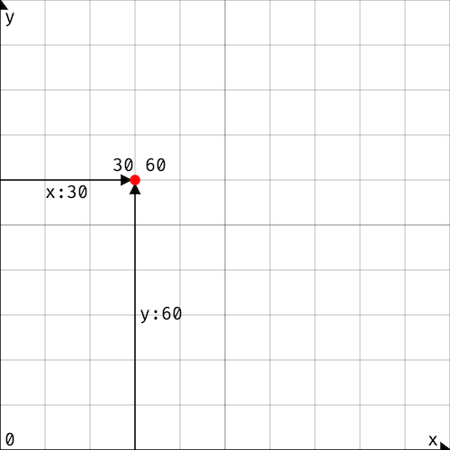

[Evy source: coordinates].

The canvas ranges from coordinates `0 0` to `100 100`. The center of the
canvas has the coordinates `50 50`.

Shapes are drawn on the canvas using a _pen_. The pen has an `x y`
position and a style. The position of the pen is also known as the
current _cursor position_.

Some graphics functions, like `line`, `rect`, `circle`, and `text`,
create shapes on the canvas. Other graphics functions such as
`color`, `width`, and `font` set the style of the pen for subsequent
drawing commands.

[Evy source: coordinates]: https://evy.dev/#content=H4sIAAAAAAAAE0WRwW6EIBCG7/MUE86NAV1w8dqkL7HxYJFtSVE2rmnXNn33DgL2NDMfA///h7fFjWCCDwuyVz+YDwZfblzfkVcnAO9mixwF5zCFz9jyxIhQC7fgN7zsQ48XfUZRydTEOfG8tL8SYSVRn/sIcokc4BrmFX/u7tt2J7wOk/Nbx17cMuBzGO0TTmEO99tgLPtNXrREAat9rMgeLCFBMKPtQGWJM0ioOVJQp3gJqY48hKUma7VG2VJtRK47z0t0qGKeus3LLSrRF56laomqzvq72OFBYK2L1e6fC5JQJVXXRJ4/Z7EjO/yTV+MW4+kC/AGSFdVbwgEAAA==

---

### `move`

`move` sets the position of the pen to the given coordinates.

#### Example

```evy
grid
move 30 60
circle 1
```

Output

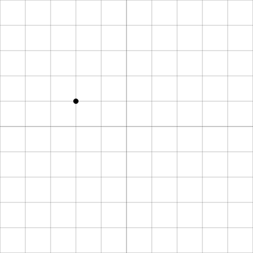

#### Reference

    move x:num y:num

The `move` function sets the position of the cursor to the given `x` and
`y` coordinates. The initial cursor position is `0 0`.

---

### `line`

`line` draws a line from the current position of the pen to the given
coordinates.

#### Example

The following example draws a triangle.

```evy
move 30 20
line 70 20
line 50 50
line 30 20
```

Output

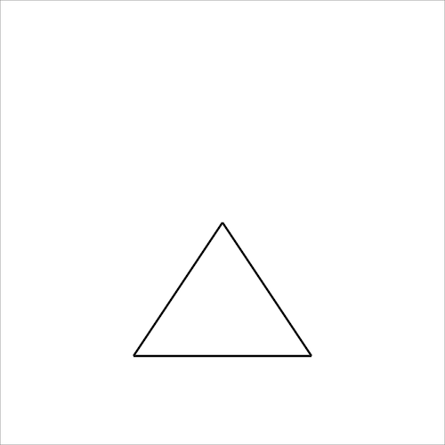

#### Reference

    line x:num y:num

The `line` function draws a line from the current cursor position to the
given `x` and `y` coordinates. The cursor position is then updated to
the given coordinates, which allows for easy polygon drawing.

---

### `rect`

`rect` draws a rectangle with the given width and height at the pen's
current position.

#### Example

```evy
grid
move 40 20
rect 10 30
rect 40 20
```

Output

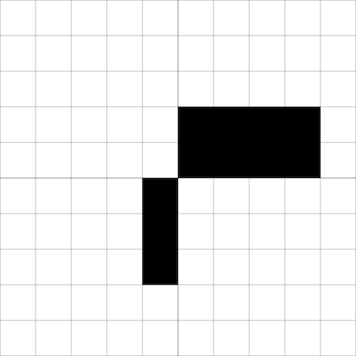

#### Reference

    rect width:num height:num

The `rect` function draws a rectangle with the given `width` and
`height` at the current cursor position. The cursor position is then
updated to the position that is the width and height away from the
current position. In other words, the opposite corner of the
rectangle is at the new cursor position.

---

### `circle`

`circle` draws a circle with given radius at the pen's current position.

#### Example

```evy
grid
move 50 50
circle 10
```

Output

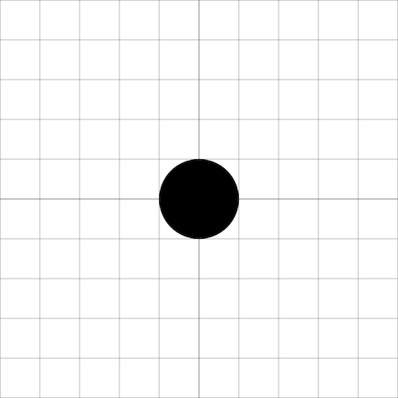

#### Reference

    circle radius:num

The `circle` function draws a circle with the given `radius` centered
at the current cursor position. The cursor position does not change
after drawing a circle.

---

### `color`

`color` changes the color of the pen. All
[CSS (Cascading Style Sheets) color values] are supported. You can start
by using the simpler [named CSS colors] , such as `"red"`,
`"darkmagenta"`, and `"springgreen"`.

[CSS (Cascading Style Sheets) color values]: https://developer.mozilla.org/en-US/docs/Web/CSS/color_value
[named CSS colors]: https://developer.mozilla.org/en-US/docs/Web/CSS/named-color

#### Example

```evy
color "darkmagenta"
rect 20 20
```

Output


#### Reference

    color c:string

The `color` function changes the color of the _stroke_ and the _fill_ to
the given CSS color string `c`. Evy supports all [CSS color values],
including semi-transparent ones. For example, the following code
changes the color to a shade of red that is 60% opaque:
`color "hsl (0deg 100% 50% / 60%)"`.

_Named CSS colors_, such as `"red"`, `"darkmagenta"`, and
`"springgreen"`, are a simpler way of specifying common colors. For a
complete list of named CSS colors, see the [Mozilla Developer
documentation].

If the color string `c` is not recognized as a valid CSS color, the color
does not change. The initial color is `"black"`.

[CSS color values]: https://developer.mozilla.org/en-US/docs/Web/CSS/color_value
[Mozilla Developer documentation]: https://developer.mozilla.org/en-US/docs/Web/CSS/named-color

---

### `colour`

`colour` is an alternate spelling of `color`. See [`color`](#color).

---

### `width`

`width` sets the thickness of the lines drawn by the pen.

#### Example

```evy
width 10
line 30 30
width 1
line 60 60
width 0.1
line 90 90
grid
```

Output

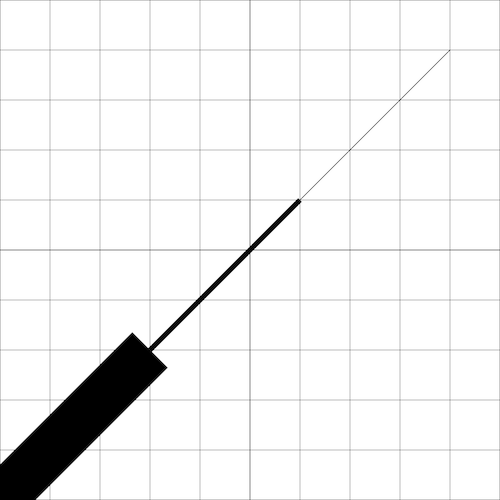

#### Reference

    width n:num

The `width` function sets the thickness of the _stroke_ to the given `n`
units. The stroke is the visible line that is drawn when using the
`line` function or any other shape function after setting
`fill "none"`. The initial stroke width it 0.1 units.

---

### `clear`

`clear` clears the canvas. Optionally, it can take a color argument to
clear the canvas to.

#### Example

The following example code shows how to draw a magenta square, clear the
canvas, and then draw a blue circle. The final result is a canvas with
a blue circle centered at `20 20`. The magenta square is not visible
because it has been removed by the `clear` function.

```evy
color "darkmagenta"
rect 20 20
clear
color "blue"
circle 5
grid
```

Output


#### Reference

    clear [c:string]

The `clear` function clears the canvas. It can optionally take a color
as a string argument, in which case the canvas will be cleared to that
color. If no color is specified, the canvas will be cleared to
`"white"`. Initially the canvas is cleared to `"white"`, not
`"transparent"`.

---

### `grid`

`grid` draws a grid on the canvas. The grid is parallel to the x and y
axes, and each grid line is spaced 10 units apart.

#### Example

```evy
grid
```

Output

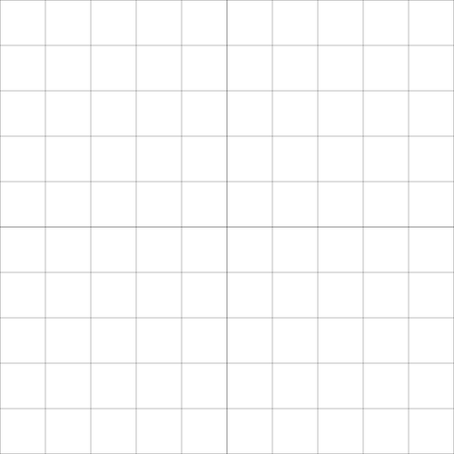

#### Reference

    grid

The `grid` function draws a grid on the canvas. The grid lines are
parallel to the x and y axes, and each grid line is spaced 10 units
apart. The grid lines are 0.1 units thin and have a semi-transparent
gray color, with an opacity of 50%. This makes the grid lines faint
enough to be drawn on top of other shapes. The grid lines that go
through the point `50 50`, which is the center of the canvas, are
slightly thicker. The thickness of these grid lines is 0.2 units, which
makes it easier to see the center of the canvas.

The `grid` function is a shorthand of the `gridn` function with the
arguments `10` and `"hsl(0deg 100% 0% / 50%)"`, see [`gridn`](#gridn).
It is roughly equivalent to the following Evy code. However, the current
color, cursor position, and line width are not affected by the builtin
`grid` function.

```evy
color "hsl(0deg 100% 0% / 50%)"
for i := range 0 101 10
    width 0.1
    if i == 50
        width 0.2
    end
    move i 0
    line i 100
    move 0 i
    line 100 i
end
```

---

### `gridn`

`gridn` draws a grid on the canvas. The grid is parallel to the x and y
axes, and each grid line is spaced the given number of units apart. The
color of the grid is set to the given color.

#### Example

```evy
gridn 2 "red"
```

Output

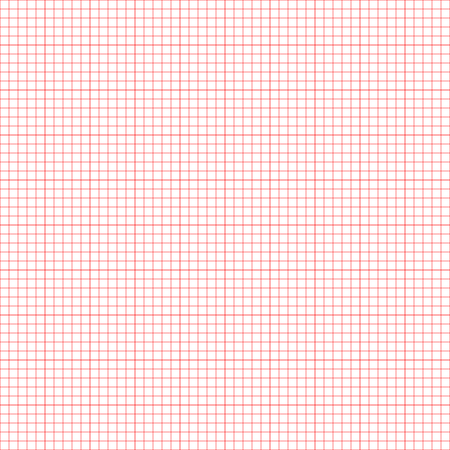

#### Reference

    gridn n:num c:string

The `gridn` function draws a grid on the canvas. The grid lines are
parallel to the x and y axes, and each grid line is spaced `n` units
apart. The color of the grid is set to the color specified by the
string argument `c`. The default line width is 0.1 units. Every fifth
grid line is slightly thicker, with a line width of 0.2 units.

The `gridn` function is roughly equivalent to the following Evy code,
but the current color, cursor position, and line width are not affected
by the builtin `gridn` function.

```evy
c := "red"
n := 2

color c
linecnt := 0
for i := range 0 101 n
    width 0.1
    if linecnt % 5 == 0
        width 0.2
    end
    linecnt = linecnt + 1
    move i 0
    line i 100
    move 0 i
    line 100 i
end
```

---

### `poly`

`poly` draws polylines and polygons for the given coordinates.

#### Example

The following code draws a w-shaped red polyline and a yellow triangle.

```evy
width 1
color "red"

fill "none"
poly [10 80] [30 60] [50 80] [70 60] [90 80]

fill "gold"
poly [10 20] [50 50] [20 10] [10 20]
```

Output

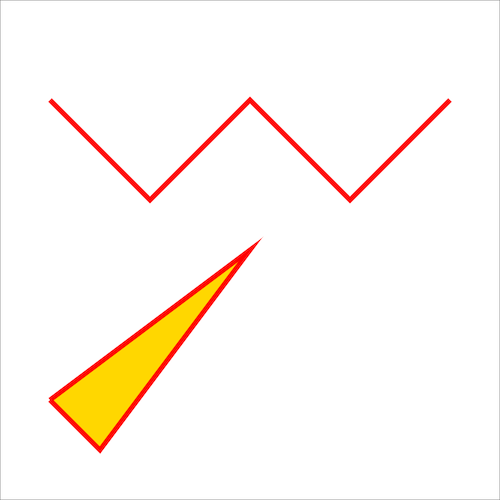

#### Reference

    poly xy:[]num...

The `poly` function draws polylines and polygons for the given
coordinates. A polyline is a sequence of connected line segments, and a
polygon is a closed polyline.

The `poly` function takes a variadic number of arguments of type
`[]num`. Each argument has to be a number array with two elements
`[x y]`. The first element representing the x coordinate and the second
the y coordinate of a vertex in the polyline or polygon. If the array
does not have two elements, a panic occurs. For example,
the `poly` function can be called as follows:

    poly [x1 y1] [x2 y2] [x3 y3]

Use `fill "none"` to draw a line without filling. To draw a closed
polygon, make sure that the first and last coordinates are the same.
The `poly` function does not use or change the cursor position.

---

### `ellipse`

`ellipse` draws an ellipse for given center, radii and optional tilt,
start and end angles.

#### Example

```evy
// red circle
color "red"
ellipse 50 50 40

// yellow, flat ellipse
color "gold"
ellipse 50 50 40 10

// blue, flat ellipse tilted by 45°
color "blue"
ellipse 50 50 40 10 45

// white, flat, half ellipse tilted by 135°
color "white"
ellipse 50 50 40 10 135 0 180
```

Output

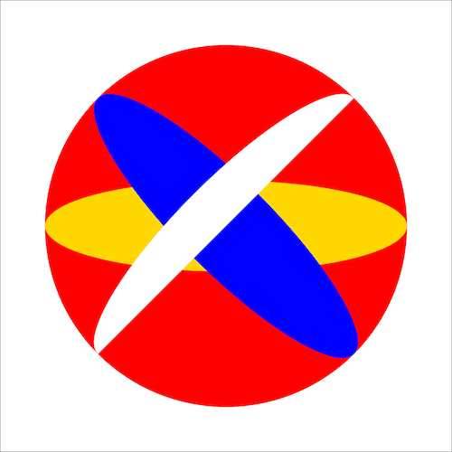

#### Reference

    ellipse x:num y:num rx:num [ry:num [tilt:num [start:num end:num]]]

The `ellipse` function draws an ellipse with the given center, radii,
tilt, and start and end angles. It can take 3, 4, 5, or 7 arguments.
Default values are used for omitted arguments.

The first two arguments are the coordinates of the center of the
ellipse. The third argument is the radius of the ellipse in the x
direction. The fourth argument is the radius of the ellipse in the y
direction. If the fourth argument is omitted, the ellipse is drawn as a
circle. The fifth argument is the tilt of the ellipse in degrees, with
a default value of 0. The sixth and seventh arguments are the start and
end angles of the ellipse in degrees, with default values of 0 and 360,
respectively.

---

### `stroke`

`stroke` sets the color of the outline of shapes.

#### Example

The following code draws two red squares, one with a blue outline.

```evy
width 1
color "red"
rect 30 30

stroke "blue"
rect 30 30
```

Output

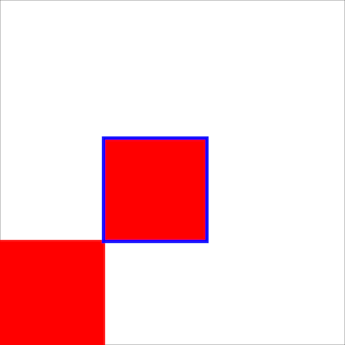

#### Reference

    stroke c:string

The `stroke` function sets the color of the _stroke_ to the given string
argument `c`. The stroke is the visible line that is drawn when you use
the line function or any other shape function after calling
fill "none". The initial stroke color is `"black"`.

---

### `fill`

`fill` sets the color of the interior of shapes.

#### Example

The following code draws a red square and a blue square with a red outline.

```evy
width 1
color "red"
rect 30 30

fill "blue"
rect 30 30
```

Output

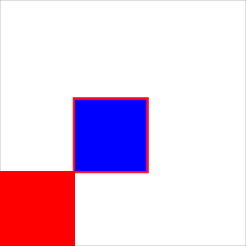

#### Reference

    fill c:string

The `fill` function sets the color of the _fill_ to the given string
argument `c`. The fill is the interior of a shape. The initial fill
color is `"black"`.

---

### `dash`

`dash` sets the line dash pattern.

#### Example

```evy
width 2

dash 5 // same as: dash 5 5, dash 5 5 5
hline 85 "red"

dash 10 4 1 4
hline 75 "blue"

dash 10 5 10 // same as: dash 10 5 10 10 5 10
hline 65 "gold"

dash // reset dash
hline 50 "black"

gridn 5 "gray"

func hline y:num c:string
    color c
    move 0 y
    line 100 y
end
```

Output

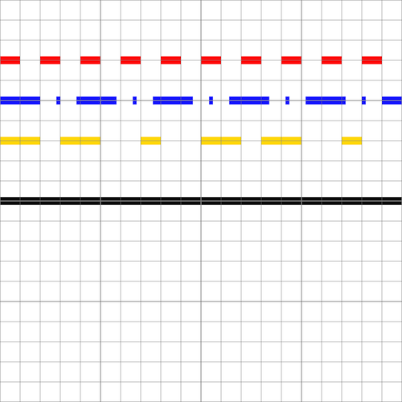

#### Reference

    dash segments:num...

The `dash` function sets the line dash pattern used when stroking lines.
The dash pattern is specified as a variadic number of arguments, where
each argument represents the length of a dash or gap. For example, the
arguments `5 10` would create a line with 5-unit long dashes and 10-unit
long gaps.

If the number of arguments is odd, they are copied and concatenated. For
example, the arguments `10 5 10` would become `10 5 10 10 5 10`. If no
arguments are given, the line returns to being solid.

The initial dash pattern is a solid line.

---

### `linecap`

`linecap` sets the shape of the ends of lines.

#### Example

```evy
width 5
grid

linecap "round"
hline 70

linecap "butt"
hline 50

linecap "square"
hline 30

func hline y:num
    move 10 y
    line 90 y
end
```

Output

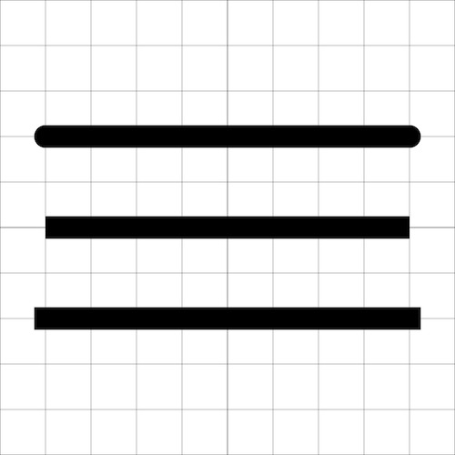

#### Reference

    linecap style:string

The `linecap` function sets the shape of the ends of lines to the
`style` string argument. Valid styles are `"round"`, `"butt"` or
`"square"`. An invalid style takes no effect.

| Style      | Description                                                                                                           |
| ---------- | --------------------------------------------------------------------------------------------------------------------- |
| `"round"`  | The ends of the line are rounded.                                                                                     |
| `"butt"`   | The ends of the line are squared off at the endpoints.                                                                |
| `"square"` | The ends of the line are squared off by adding a box with an equal width and half the height of the line's thickness. |

The initial linecap style is `"round"`.

---

### `text`

`text` prints text to the canvas at the current cursor position.

#### Example

```evy
move 20 70
text "“Time is an illusion."
move 20 63
text "Lunchtime doubly so.”"
move 35 48
text "― Douglas Adams"
```

Output

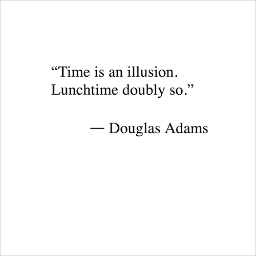

#### Reference

    text s:string

The `text` function prints the string argument `s` to the canvas at the
current cursor position. The cursor position is not updated after
writing text. Only `fill` and `color` have an effect on the text;
`stroke` has no effect. For more text styling, such as setting
_font size_ or _font family_, see [`font`](#font).

---

### `font`

`font` sets the font properties for text. The font properties are
`family`,`size`, `weight`, `style`, `letterspacing`, `baseline`, and
`align`.

#### Example

```evy
font {family:"Bradley Hand, cursive" size:4}

move 10 65
text "“The wonderful thing about programming"
move 10 60
text "is that anyone can learn it and do it. You"
move 10 55
text "don't have to be a genius or have a specific"
move 10 50
text "background. You just need curiosity and"
move 10 45
text "the willingness to try.”"

// all font properties
font {
    size:9
    style:"normal" // "normal"
    family:"Tahomana, sans-serif" // see https://developer.mozilla.org/en-US/docs/Web/CSS/font-family
    weight:900
    letterspacing:-0.5 // extra inter-character space. negative allowed. default:0
    align:"right" // "left", "right"
    baseline:"middle" // "top", "bottom", "alphabetic" (default)
}

move 90 32
color "red"
text "Grace Hopper"
color "black"
font {size:4 letterspacing:0 weight:100 style:"normal"}
move 90 25
text "computer scientist, compiler builder"
```

Output

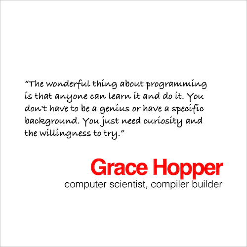

The following example shows the effect of the `align` and `baseline`
properties:

```evy
font {size:6 family:"Fira Code, monospace"}

move 25 78
line 25 86
move 25 80
font {align:"left"}
text "left"

move 25 63
line 25 71
move 25 65
font {align:"right"}
text "right"

move 25 48
line 25 56
move 25 50
font {align:"center"}
text "center"

move 55 80
line 90 80
move 55 80
font {baseline:"bottom" align:"left"}
text "bottom"

move 55 65
line 90 65
move 55 65
font {baseline:"top"}
text "top"

move 55 50
line 90 50
move 55 50
font {baseline:"middle"}
text "middle"

move 55 35
line 90 35
move 55 35
font {baseline:"alphabetic"}
text "alphabetic"
```

Output

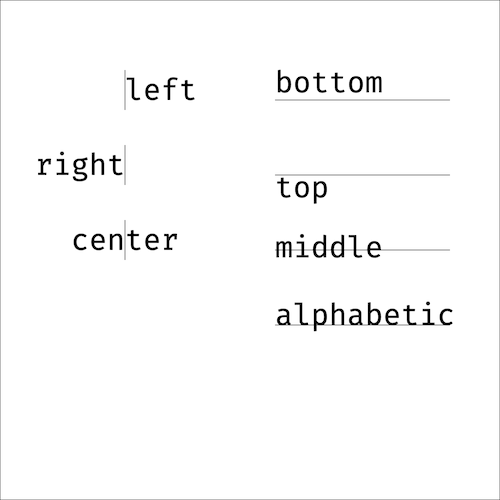

#### Reference

    font props:{}any

The `font` function sets the font properties for text. The font
properties are `family`, `size`, `weight`, `style`, `letterspacing`,
`align`, and `baseline`.

The `family` property specifies a prioritized list of one or more font
family names. Values are separated by commas to indicate that they are
alternatives. The browser will select the first available font. For
example, the value `"Fira Code, monospace"` would specify that the
browser should try to use the Fira Code font, but if that font is not
available, it should use a monospace font. The default font family is
the browser default.

The `size` property specifies the height of a letter in canvas units.
The default size is 6.

The `weight` property specifies the boldness of the font. The values
100, 200, ..., 900 can be used to specify the weight of the font. The
value 400 is normal, 700 is bold. The default weight is 400.

The `style` property specifies the sloping of the font. The values
`"normal"` and `"italic"` can be used to specify the style of the font.
The default style is "normal".

The `letterspacing` property specifies the additional horizontal space
between text characters in canvas units. The default value is 0.

The `align` property specifies the horizontal alignment of the text. The
values `"left"`, `"right"`, and `"center"` can be used to specify the
alignment. The default value is `"left"`.

The `baseline` property specifies the vertical cursor position relative to
the vertical text position. The values `"top"`, `"bottom"`, `"middle"`,
and `"alphabetic"` can be used to specify the baseline. The default value
is `"alphabetic"`.

Here is an example of how to use the font function:

```evy
font {
    family:"Fira Code, monospace"
    size:9
    weight:700
    style:"italic"
    letterspacing:0.5
    baseline:"top"
    align:"center"
}
```

This code sets the font properties to use the Fira Code font, a size of
9, a weight of 700, an italic style, a letterspacing of 0.5, a top
baseline, and a center alignment.

## Event Handlers

Evy first executes all top-level code in the order it appears in the
source code. If there is at least one event handler, Evy then enters an
event loop. In the event loop, Evy waits for external events, such as a
key press or a pointer down event. When an event occurs, Evy calls the
corresponding event handler function if it has been implemented. The
event handler function can optionally receive arguments, such as the key
character or the pointer coordinates. Once the event handler function
has finished, Evy returns to the event loop and waits for the next
event.

Event handlers are declared using the `on` keyword. Only predefined
events can be handled: `key`, `down`, `up`, `move`, `animate`, and
`input`. For example, the following code defines an event handler for
the key press event:

```evy
on key k:string
    print k
end
```

The parameters to the event handlers must match the expected signature.
The `key` event handler expects a single parameter of type string,
which is the character that was pressed. The parameters can be fully
omitted or fully specified. If only some parameters are needed, use the
anonymous `_` parameter. The `down` event handler, for instance,
expects two parameters, the x and y coordinates of the pointer. If you
only need the x coordinate, you can use `on down x:num _:num`.

Pointer events, such as `down`, `up`, and `move`, occur when a pointing
input device, such as a mouse, a pen or stylus, or a finger, is used to
interact with the canvas.

---

### `key`

`key` is called when a key on the keyboard is pressed.

#### Example

```evy
on key k:string
    print k
end
```

Sample output

```
Escape
Shift
R
o
```

#### Reference

    key k:string

The `key` event handler is called when a _keydown_ event occurs. The
handler is passed a string argument which is the character of the key
that was pressed. For example, if the user presses the `a` key, the
argument would be the string `"a"`.

Some keys do not have a character representation, such as the arrow keys
or the shift key. For these keys, the argument is a special string,
such as `"ArrowRight"`, `"ArrowUp"`, `"Shift"`, `"Enter"`, `"Control"`,
`"Alt"`, `"Backspace"`, or `"Escape"`.

When the shift key is pressed and then another key is pressed, the
argument is the uppercase or special character representation of the
key that was pressed. For example, if the user presses `shift`+`a`, the
argument is the string `"A"`.

---

### `down`

`down` is called when the pointer is pressed down.

#### Example

```evy
on down x:num y:num
    printf "x: %2.0f y: %2.0f\n" x y
end
```

Sample output

```
x: 42 y: 85
x:  7 y:  6
```

#### Reference

    down x:num y:num

The `down` event handler is called when a _pointerdown_ event occurs on
the canvas. The handler is passed two number arguments, `x` and `y`,
which are the coordinates of the pointer location when the pointer was
pressed down. The pointer is typically a mouse, stylus or finger.

---

### `up`

`up` is called when the pointer is lifted up.

#### Example

```evy
on up x:num y:num
    move x y
    color "red"
    circle 1
end
```

Sample output


#### Reference

    up x:num y:num

The `up` event handler is called when a _pointerup_ event occurs on the
canvas. The handler is passed two number arguments, `x` and `y`, which
are the coordinates of the pointer location when the pointer was lifted
up. The pointer is typically a mouse, stylus or finger.

---

### `move`

`move` is called when the pointer is moved.

#### Example

The following sample draws a line following the pointer's movement.

```evy
down := false
width 1

on down x:num y:num
    down = true
    move x y
end

on move x:num y:num
    if down
        line x y
    end
end

on up
    down = false
end
```

Sample output

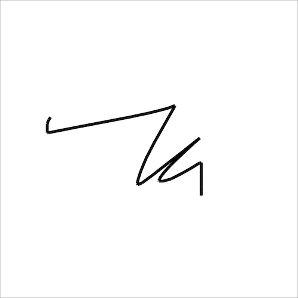

#### Reference

    move x:num y:num

The `move` event handler is called when a _pointermove_ event occurs on
the canvas. The handler is passed two number arguments, `x` and `y`,
which are the coordinates of the position that the pointer has moved
to. The pointer is typically a mouse, stylus or finger.

---

### `animate`

`animate` gets called periodically around 60 times per second.

#### Example

```evy
semiblack := "hsl(0deg 0% 0% / 10%)"
width 1
fill semiblack
stroke "red"

on animate ms:num
    clear semiblack
    y := 100 - (ms / 20) % 100
    move 50 y
    circle 10
end
```

Output

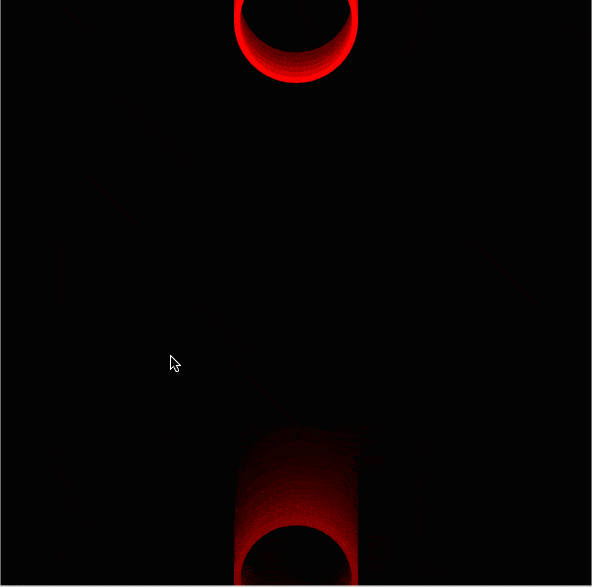

#### Reference

    animate elapsed:num

The `animate` event handler is called when an animation frame is
available. This means that the handler will be called typically 60
times in a second, but it will generally match the display refresh
rate. If the computations within a single animate call take too long,
the frame rate will drop.

The animate event handler is passed a single numeric argument which is
the number of elapsed milliseconds since the start of the animation.
This allows you to track the progress of the animation and to update
the animation accordingly.

---

### `input`

`input` is called when the value of an input element changes.

#### Example

```evy
on input id:string val:string
    print "id:" id "val:" val
end
```

Sample Output from the Evy website

```
id: sliderx val: 15
id: slidery val: 0
id: slidery val: 100
```

#### Reference

    input id:string val:id

The `input` event handler is called when the value of an input element
changes. The handler is passed two string arguments: the id of the
input element and its new value.

For example, if you have an input element with the id `sliderx` and the
user changes the value of the slider to `15`, the input event handler
will be called with the arguments `sliderx` and `15`.

The Evy web interface has two sliders that are used as input elements.
The sliders range from 0 to 100, and their ids are `sliderx` and
`slidery`. When you change the position of the sliders the `input`
event handler is called with the new position value of the slider.
