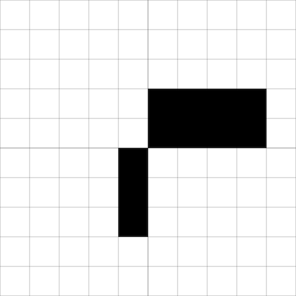
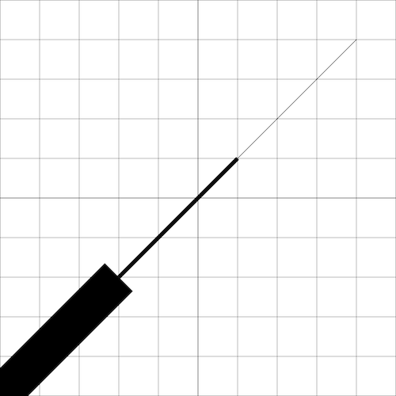
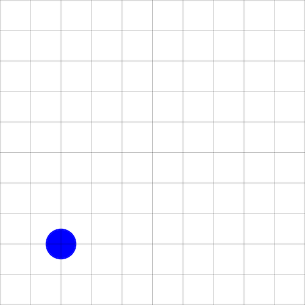
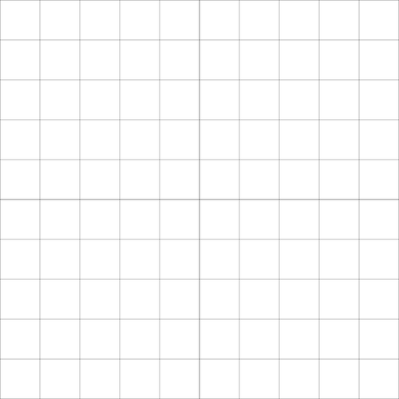
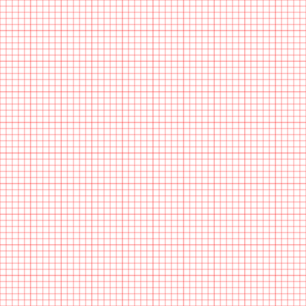
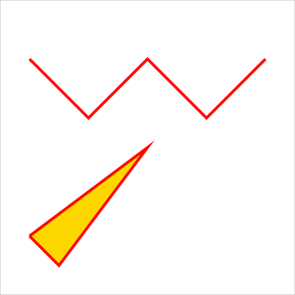

# Graphics

`evy` on the web outputs drawing commands to a drawing area
called the _canvas_.

Positions on the canvas are defined by a coordinate system, similar to
the Cartesian coordinate system used in mathematics. The horizontal
dimension is called the _x-axis_, and the vertical dimension is
called the _y-axis_.

A point on the canvas is defined by its _x_ and _y coordinates_,
which are written as `x y`. For example, the point `30 60` has an
x-coordinate of 30 and a y-coordinate of 60. It is located 30 units
from the left edge of the canvas and 60 units from the bottom edge.


[Evy source: coordinates].

The canvas ranges from coordinates `0 0` to `100 100`. The center of the
canvas has the coordinates `50 50`.

Shapes are drawn on the canvas using a _pen_. The pen has an `x y`
position and a style. The position of the pen is also known as the
current _cursor position_.

Some graphics functions, like `line`, `rect`, `circle`, and `text`,
create shapes on the canvas. Other graphics functions such as
`color`, `width`, and `font` set the style of the pen for subsequent
drawing commands.

[Evy source: coordinates]: https://evy.dev/#content=H4sIAAAAAAAAE0WRwW6EIBCG7/MUE86NAV1w8dqkL7HxYJFtSVE2rmnXNn33DgL2NDMfA///h7fFjWCCDwuyVz+YDwZfblzfkVcnAO9mixwF5zCFz9jyxIhQC7fgN7zsQ48XfUZRydTEOfG8tL8SYSVRn/sIcokc4BrmFX/u7tt2J7wOk/Nbx17cMuBzGO0TTmEO99tgLPtNXrREAat9rMgeLCFBMKPtQGWJM0ioOVJQp3gJqY48hKUma7VG2VJtRK47z0t0qGKeus3LLSrRF56laomqzvq72OFBYK2L1e6fC5JQJVXXRJ4/Z7EjO/yTV+MW4+kC/AGSFdVbwgEAAA==

## `move`

`move` sets the position of the pen to the given coordinates.

### Example

```evy
grid
move 30 60
circle 1
```

Output


### Reference

    move x:num y:num

The `move` function sets the position of the cursor to the given `x` and
`y` coordinates. The initial cursor position is `0 0`.

## `line`

`line` draws a line from the current position of the pen to the given
coordinates.

### Example

The following example draws a triangle.

```evy
move 30 20
line 70 20
line 50 50
line 30 20
```

Output


### Reference

    line x:num y:num

The `line` function draws a line from the current cursor position to the
given `x` and `y` coordinates. The cursor position is then updated to
the given coordinates, which allows for easy polygon drawing.

## `rect`

`rect` draws a rectangle with the given width and height at the pen's
current position.

### Example

```evy
grid
move 40 20
rect 10 30
rect 40 20
```

Output



### Reference

    rect width:num height:num

The `rect` function draws a rectangle with the given `width` and
`height` at the current cursor position. The cursor position is then
updated to the position that is the width and height away from the
current position. In other words, the opposite corner of the
rectangle is at the new cursor position.

## `circle`

`circle` draws a circle with given radius at the pen's current position.

### Example

```evy
grid
move 50 50
circle 10
```

Output


### Reference

    circle radius:num

The `circle` function draws a circle with the given `radius` centered
at the current cursor position. The cursor position does not change
after drawing a circle.

## `color`

`color` changes the color of the pen. All
[CSS (Cascading Style Sheets) color values] are supported. You can start
by using the simpler [named CSS colors] , such as `"red"`,
`"darkmagenta"`, and `"springgreen"`.

[CSS (Cascading Style Sheets) color values]: https://developer.mozilla.org/en-US/docs/Web/CSS/color_value
[named CSS colors]: https://developer.mozilla.org/en-US/docs/Web/CSS/named-color

### Example

```evy
color "darkmagenta"
rect 20 20
```

Output


### Reference

    color c:string

The `color` function changes the color of the _stroke_ and the _fill_ to
the given CSS color string `c`. Evy supports all [CSS color values],
including semi-transparent ones. For example, the following code
changes the color to a shade of red that is 60% opaque:
`color "hsl (0deg 100% 50% / 60%)"`.

_Named CSS colors_, such as `"red"`, `"darkmagenta"`, and
`"springgreen"`, are a simpler way of specifying common colors. For a
complete list of named CSS colors, see the [Mozilla Developer
documentation].

If the color string `c` is not recognized as a valid CSS color, the color
does not change. The initial color is `"black"`.

[CSS color values]: https://developer.mozilla.org/en-US/docs/Web/CSS/color_value
[Mozilla Developer documentation]: https://developer.mozilla.org/en-US/docs/Web/CSS/named-color

## `colour`

`colour` is an alternate spelling of `color`. See [`color`](#color).

## `width`

`width` sets the thickness of the lines drawn by the pen.

### Example

```evy
width 10
line 30 30
width 1
line 60 60
width 0.1
line 90 90
grid
```

Output



### Reference

    width n:num

The `width` function sets the thickness of the _stroke_ to the given `n`
units. The stroke is the visible line that is drawn when using the
`line` function or any other shape function after setting
`fill "none"`. The initial stroke width it 0.1 units.

## `clear`

`clear` clears the canvas. Optionally, it can take a color argument to
clear the canvas to.

### Example

The following example code shows how to draw a magenta square, clear the
canvas, and then draw a blue circle. The final result is a canvas with
a blue circle centered at `20 20`. The magenta square is not visible
because it has been removed by the `clear` function.

```evy
color "darkmagenta"
rect 20 20
clear
color "blue"
circle 5
grid
```

Output



### Reference

    clear [c:string]

The `clear` function clears the canvas. It can optionally take a color
as a string argument, in which case the canvas will be cleared to that
color. If no color is specified, the canvas will be cleared to
`"white"`. Initially the canvas is cleared to `"white"`, not
`"transparent"`.

## `grid`

`grid` draws a grid on the canvas. The grid is parallel to the x and y
axes, and each grid line is spaced 10 units apart.

### Example

```evy
grid
```

Output



### Reference

    grid

The `grid` function draws a grid on the canvas. The grid lines are
parallel to the x and y axes, and each grid line is spaced 10 units
apart. The grid lines are 0.1 units thin and have a semi-transparent
gray color, with an opacity of 50%. This makes the grid lines faint
enough to be drawn on top of other shapes. The grid lines that go
through the point `50 50`, which is the center of the canvas, are
slightly thicker. The thickness of these grid lines is 0.2 units, which
makes it easier to see the center of the canvas.

The `grid` function is a shorthand of the `gridn` function with the
arguments `10` and `"hsl(0deg 100% 0% / 50%)"`, see [`gridn`](#gridn).
It is roughly equivalent to the following Evy code. However, the current
color, cursor position, and line width are not affected by the builtin
`grid` function.

```evy
color "hsl(0deg 100% 0% / 50%)"
for i := range 0 101 10
    width 0.1
    if i == 50
        width 0.2
    end
    move i 0
    line i 100
    move 0 i
    line 100 i
end
```

## `gridn`

`gridn` draws a grid on the canvas. The grid is parallel to the x and y
axes, and each grid line is spaced the given number of units apart. The
color of the grid is set to the given color.

### Example

```evy
gridn 2 "red"
```

Output



### Reference

    gridn n:num c:string

The `gridn` function draws a grid on the canvas. The grid lines are
parallel to the x and y axes, and each grid line is spaced `n` units
apart. The color of the grid is set to the color specified by the
string argument `c`. The default line width is 0.1 units. Every fifth
grid line is slightly thicker, with a line width of 0.2 units.

The `gridn` function is roughly equivalent to the following Evy code,
but the current color, cursor position, and line width are not affected
by the builtin `gridn` function.

```evy
c := "red"
n := 2

color c
linecnt := 0
for i := range 0 101 n
    width 0.1
    if linecnt % 5 == 0
        width 0.2
    end
    linecnt = linecnt + 1
    move i 0
    line i 100
    move 0 i
    line 100 i
end
```

## `poly`

`poly` draws polylines and polygons for the given coordinates.

### Example

The following code draws a w-shaped red polyline and a yellow triangle.

```evy
width 1
color "red"

fill "none"
poly [10 80] [30 60] [50 80] [70 60] [90 80]

fill "gold"
poly [10 20] [50 50] [20 10] [10 20]
```

Output



### Reference

    poly xy:[]num...

The `poly` function draws polylines and polygons for the given
coordinates. A polyline is a sequence of connected line segments, and a
polygon is a closed polyline.

The `poly` function takes a variadic number of arguments of type
`[]num`. Each argument has to be a number array with two elements
`[x y]`. The first element representing the x coordinate and the second
the y coordinate of a vertex in the polyline or polygon. If the array
does not have two elements, a fatal runtime error occurs. For example,
the `poly` function can be called as follows:

    poly [x1 y1] [x2 y2] [x3 y3]

Use `fill "none"` to draw a line without filling. To draw a closed
polygon, make sure that the first and last coordinates are the same.
The `poly` function does not use or change the cursor position.

## `ellipse`

`ellipse` draws an ellipse for given center, radii and optional tilt,
start and end angles.

### Example

```evy
// red circle
color "red"
ellipse 50 50 40

// yellow, flat ellipse
color "gold"
ellipse 50 50 40 10

// blue, flat ellipse tilted by 45°
color "blue"
ellipse 50 50 40 10 45

// white, flat, half ellipse tilted by 135°
color "white"
ellipse 50 50 40 10 135 0 180
```

Output


### Reference

    ellipse x:num y:num rx:num [ry:num [tilt:num [start:num end:num]]]

The `ellipse` function draws an ellipse with the given center, radii,
tilt, and start and end angles. It can take 3, 4, 5, or 7 arguments.
Default values are used for omitted arguments.

The first two arguments are the coordinates of the center of the
ellipse. The third argument is the radius of the ellipse in the x
direction. The fourth argument is the radius of the ellipse in the y
direction. If the fourth argument is omitted, the ellipse is drawn as a
circle. The fifth argument is the tilt of the ellipse in degrees, with
a default value of 0. The sixth and seventh arguments are the start and
end angles of the ellipse in degrees, with default values of 0 and 360,
respectively.

## `stroke`

`stroke` sets the color of the outline of shapes.

### Example

The following code draws two red squares, one with a blue outline.

```evy
width 1
color "red"
rect 30 30

stroke "blue"
rect 30 30
```

Output


### Reference

    stroke c:string

The `stroke` function sets the color of the _stroke_ to the given string
argument `c`. The stroke is the visible line that is drawn when you use
the line function or any other shape function after calling
fill "none". The initial stroke color is `"black"`.

## `fill`

`fill` sets the color of the interior of shapes.

### Example

The following code draws a red square and a blue square with a red outline.

```evy
width 1
color "red"
rect 30 30

fill "blue"
rect 30 30
```

Output


### Reference

    fill c:string

The `fill` function sets the color of the _fill_ to the given string
argument `c`. The fill is the interior of a shape. The initial fill
color is `"black"`.

## `dash`

`dash` sets the line dash pattern.

### Example

```evy
width 2

dash 5 // same as: dash 5 5, dash 5 5 5
hline 85 "red"

dash 10 4 1 4
hline 75 "blue"

dash 10 5 10 // same as: dash 10 5 10 10 5 10
hline 65 "gold"

dash // reset dash
hline 50 "black"

gridn 5 "gray"

func hline y:num c:string
    color c
    move 0 y
    line 100 y
end
```

Output


### Reference

    dash segments:num...

The `dash` function sets the line dash pattern used when stroking lines.
The dash pattern is specified as a variadic number of arguments, where
each argument represents the length of a dash or gap. For example, the
arguments `5 10` would create a line with 5-unit long dashes and 10-unit
long gaps.

If the number of arguments is odd, they are copied and concatenated. For
example, the arguments `10 5 10` would become `10 5 10 10 5 10`. If no
arguments are given, the line returns to being solid.

The initial dash pattern is a solid line.

## `linecap`

`linecap` sets the shape of the ends of lines.

### Example

```evy
width 5
grid

linecap "round"
hline 70

linecap "butt"
hline 50

linecap "square"
hline 30

func hline y:num
    move 10 y
    line 90 y
end
```

Output


### Reference

    linecap style:string

The `linecap` function sets the shape of the ends of lines to the
`style` string argument. Valid styles are `"round"`, `"butt"` or
`"square"`. An invalid style takes no effect.

| Style      | Description                                                                                                           |
| ---------- | --------------------------------------------------------------------------------------------------------------------- |
| `"round"`  | The ends of the line are rounded.                                                                                     |
| `"butt"`   | The ends of the line are squared off at the endpoints.                                                                |
| `"square"` | The ends of the line are squared off by adding a box with an equal width and half the height of the line's thickness. |

The initial linecap style is `"round"`.

## `text`

`text` prints text to the canvas at the current cursor position.

### Example

```evy
move 20 70
text "“Time is an illusion."
move 20 63
text "Lunchtime doubly so.”"
move 35 48
text "― Douglas Adams"
```

Output


### Reference

    text s:string

The `text` function prints the string argument `s` to the canvas at the
current cursor position. The cursor position is not updated after
writing text. Only `fill` and `color` have an effect on the text;
`stroke` has no effect. For more text styling, such as setting
_font size_ or _font family_, see [`font`](#font).

## `font`

`font` sets the font properties for text. The font properties are
`family`,`size`, `weight`, `style`, `letterspacing`, `baseline`, and
`align`.

### Example

```evy
font {family:"Bradley Hand, cursive" size:4}

move 10 65
text "“The wonderful thing about programming"
move 10 60
text "is that anyone can learn it and do it. You"
move 10 55
text "don't have to be a genius or have a specific"
move 10 50
text "background. You just need curiosity and"
move 10 45
text "the willingness to try.”"

// all font properties
font {
    size:9
    style:"normal" // "normal"
    family:"Tahomana, sans-serif" // see https://developer.mozilla.org/en-US/docs/Web/CSS/font-family
    weight:900
    letterspacing:-0.5 // extra inter-character space. negative allowed. default:0
    align:"right" // "left", "right"
    baseline:"middle" // "top", "bottom", "alphabetic" (default)
}

move 90 32
color "red"
text "Grace Hopper"
color "black"
font {size:4 letterspacing:0 weight:100 style:"normal"}
move 90 25
text "computer scientist, compiler builder"
```

Output


The following example shows the effect of the `align` and `baseline`
properties:

```evy
font {size:6 family:"Fira Code, monospace"}

move 25 78
line 25 86
move 25 80
font {align:"left"}
text "left"

move 25 63
line 25 71
move 25 65
font {align:"right"}
text "right"

move 25 48
line 25 56
move 25 50
font {align:"center"}
text "center"

move 55 80
line 90 80
move 55 80
font {baseline:"bottom" align:"left"}
text "bottom"

move 55 65
line 90 65
move 55 65
font {baseline:"top"}
text "top"

move 55 50
line 90 50
move 55 50
font {baseline:"middle"}
text "middle"

move 55 35
line 90 35
move 55 35
font {baseline:"alphabetic"}
text "alphabetic"
```

Output


### Reference

    font props:{}any

The `font` function sets the font properties for text. The font
properties are `family`, `size`, `weight`, `style`, `letterspacing`,
`align`, and `baseline`.

The `family` property specifies a prioritized list of one or more font
family names. Values are separated by commas to indicate that they are
alternatives. The browser will select the first available font. For
example, the value `"Fira Code, monospace"` would specify that the
browser should try to use the Fira Code font, but if that font is not
available, it should use a monospace font. The default font family is
the browser default.

The `size` property specifies the height of a letter in canvas units.
The default size is 6.

The `weight` property specifies the boldness of the font. The values
100, 200, ..., 900 can be used to specify the weight of the font. The
value 400 is normal, 700 is bold. The default weight is 400.

The `style` property specifies the sloping of the font. The values
`"normal"` and `"italic"` can be used to specify the style of the font.
The default style is "normal".

The `letterspacing` property specifies the additional horizontal space
between text characters in canvas units. The default value is 0.

The `align` property specifies the horizontal alignment of the text. The
values `"left"`, `"right"`, and `"center"` can be used to specify the
alignment. The default value is `"left"`.

The `baseline` property specifies the vertical cursor position relative to
the vertical text position. The values `"top"`, `"bottom"`, `"middle"`,
and `"alphabetic"` can be used to specify the baseline. The default value
is `"alphabetic"`.

Here is an example of how to use the font function:

```evy
font {
    family:"Fira Code, monospace"
    size:9
    weight:700
    style:"italic"
    letterspacing:0.5
    baseline:"top"
    align:"center"
}
```

This code sets the font properties to use the Fira Code font, a size of
9, a weight of 700, an italic style, a letterspacing of 0.5, a top
baseline, and a center alignment.
