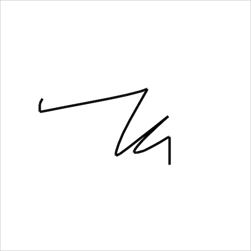

# Event Handlers

Evy first executes all top-level code in the order it appears in the
source code. If there is at least one event handler, Evy then enters an
event loop. In the event loop, Evy waits for external events, such as a
key press or a pointer down event. When an event occurs, Evy calls the
corresponding event handler function if it has been implemented. The
event handler function can optionally receive arguments, such as the key
character or the pointer coordinates. Once the event handler function
has finished, Evy returns to the event loop and waits for the next
event.

Event handlers are declared using the `on` keyword. Only predefined
events can be handled: `key`, `down`, `up`, `move`, `animate`, and
`input`. For example, the following code defines an event handler for
the key press event:

```evy
on key k:string
    print k
end
```

The parameters to the event handlers must match the expected signature.
The `key` event handler expects a single parameter of type string,
which is the character that was pressed. The parameters can be fully
omitted or fully specified. If only some parameters are needed, use the
anonymous `_` parameter. The `down` event handler, for instance,
expects two parameters, the x and y coordinates of the pointer. If you
only need the x coordinate, you can use `on down x:num _:num`.

Pointer events, such as `down`, `up`, and `move`, occur when a pointing
input device, such as a mouse, a pen or stylus, or a finger, is used to
interact with the canvas.

## `key`

`key` is called when a key on the keyboard is pressed.

### Example

```evy
on key k:string
    print k
end
```

Sample output

```
Escape
Shift
R
o
```

### Reference

    key k:string

The `key` event handler is called when a _keydown_ event occurs. The
handler is passed a string argument which is the character of the key
that was pressed. For example, if the user presses the `a` key, the
argument would be the string `"a"`.

Some keys do not have a character representation, such as the arrow keys
or the shift key. For these keys, the argument is a special string,
such as `"ArrowRight"`, `"ArrowUp"`, `"Shift"`, `"Enter"`, `"Control"`,
`"Alt"`, `"Backspace"`, or `"Escape"`.

When the shift key is pressed and then another key is pressed, the
argument is the uppercase or special character representation of the
key that was pressed. For example, if the user presses `shift`+`a`, the
argument is the string `"A"`.

## `down`

`down` is called when the pointer is pressed down.

### Example

```evy
on down x:num y:num
    printf "x: %2.0f y: %2.0f\n" x y
end
```

Sample output

```
x: 42 y: 85
x:  7 y:  6
```

### Reference

    down x:num y:num

The `down` event handler is called when a _pointerdown_ event occurs on
the canvas. The handler is passed two number arguments, `x` and `y`,
which are the coordinates of the pointer location when the pointer was
pressed down. The pointer is typically a mouse, stylus or finger.

## `up`

`up` is called when the pointer is lifted up.

### Example

```evy
on up x:num y:num
    move x y
    color "red"
    circle 1
end
```

Sample output


### Reference

    up x:num y:num

The `up` event handler is called when a _pointerup_ event occurs on the
canvas. The handler is passed two number arguments, `x` and `y`, which
are the coordinates of the pointer location when the pointer was lifted
up. The pointer is typically a mouse, stylus or finger.

## `move`

`move` is called when the pointer is moved.

### Example

The following sample draws a line following the pointer's movement.

```evy
down := false
width 1

on down x:num y:num
    down = true
    move x y
end

on move x:num y:num
    if down
        line x y
    end
end

on up
    down = false
end
```

Sample output



### Reference

    move x:num y:num

The `move` event handler is called when a _pointermove_ event occurs on
the canvas. The handler is passed two number arguments, `x` and `y`,
which are the coordinates of the position that the pointer has moved
to. The pointer is typically a mouse, stylus or finger.

## `animate`

`animate` gets called periodically around 60 times per second.

### Example

```evy
semiblack := "hsl(0deg 0% 0% / 10%)"
width 1
fill semiblack
stroke "red"

on animate ms:num
    clear semiblack
    y := 100 - (ms / 20) % 100
    move 50 y
    circle 10
end
```

Output


### Reference

    animate elapsed:num

The `animate` event handler is called when an animation frame is
available. This means that the handler will be called typically 60
times in a second, but it will generally match the display refresh
rate. If the computations within a single animate call take too long,
the frame rate will drop.

The animate event handler is passed a single numeric argument which is
the number of elapsed milliseconds since the start of the animation.
This allows you to track the progress of the animation and to update
the animation accordingly.

## `input`

`input` is called when the value of an input element changes.

### Example

```evy
on input id:string val:string
    print "id:" id "val:" val
end
```

Sample Output from the Evy website

```
id: sliderx val: 15
id: slidery val: 0
id: slidery val: 100
```

### Reference

    input id:string val:id

The `input` event handler is called when the value of an input element
changes. The handler is passed two string arguments: the id of the
input element and its new value.

For example, if you have an input element with the id `sliderx` and the
user changes the value of the slider to `15`, the input event handler
will be called with the arguments `sliderx` and `15`.

The Evy web interface has two sliders that are used as input elements.
The sliders range from 0 to 100, and their ids are `sliderx` and
`slidery`. When you change the position of the sliders the `input`
event handler is called with the new position value of the slider.
