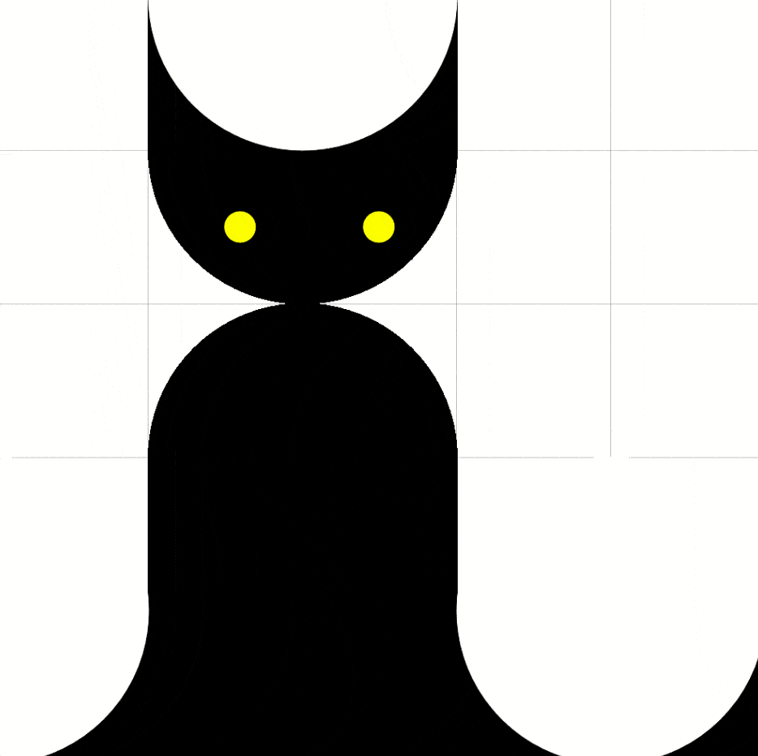

# 🟢 Circles

## ⭐ Intro

**Read** the code. What do you think will happen when you run it?

**Run** the code. Was it what you expected?

[Next]

## ⭐ Circles with `for` Loops

Use `for` loops and circles to create your own unique drawing.

🧪 Experiment with colors, sizes, and positions.

- Can you use `hsl` and transparency in your creation?
- Can you add randomness?
- Can you animate your creation?

### Need ideas?

**Click** on the images below for their Evy code.

| ![Circle with different outline] | ![Circle in wig shape] |
| -------------------------------- | ---------------------- |
| ![Circle with random radius]     | ![Cat made of circles] |

[Circle with different outline]: img/circle-outline.svg "evy:edit"
[Circle in wig shape]: img/circle-wig.svg "evy:edit"
[Circle with random radius]: img/circle-rand.svg "evy:edit"
[Cat made of circles]: img/circle-cat.svg "evy:edit"

[Next]

## ⭐ Move the Cat Eyes 👀

Use the code from the cat sample above and make its eyes move:



## [>] Hint

Wrap the whole cat drawing in a `for` loop and modify the `// eyes` block:

```evy
for x := range 1000
  // ...
  // eyes
  offset := x % 12 / 8
  move 31+offset 70
  circle 2
  move 49+offset 70
  // ...
end
```
