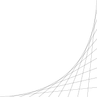

# 🌐📺 Lines

**Run** the program and observe animated lines.

For this program we need two **nested** `for` loops.

⭐ How would you go about writing this program?

## [>] Hint

- Break down your problem into smaller bits.
- Create a _static_ image with 10 lines (see picture below).
- What needs to change to turn the static image into an animation?

  
