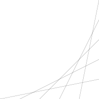

# 🌐🫵 Lines

⭐ Can you complete the program create this output?



---

⭐ Can you update the program with a single `for` loop to create same output?

### [>] Hint

```evy
for a := range 0 100 20
    move ❓ 0
    line ❓ ❓
end
```

---

⭐ Can you change the program to create the following outputs, with step `25`,
`10`, `5`, and `2`.

| ![4 Lines]  | ![10 Lines] |
| ----------- | ----------- |
| ![20 Lines] | ![50 Lines] |

[4 Lines]: img/4-lines.svg "evy:edit"
[10 Lines]: img/10-lines.svg "evy:edit"
[20 Lines]: img/20-lines.svg "evy:edit"
[50 Lines]: img/50-lines.svg "evy:edit"

---

⭐ Can you declare a variable called `step` and use it with `range` and `line`?

### [>] Hint

```evy
step := 10
for a := range 0 100 step
    move ❓ 0
    line ❓ ❓
end
```

---

## ⭐ Animate

Add a second, wrapping, outer loop that ranges over the `step` variable.

- Start `step` at `20`
- Keep looping as long as `step` is greater then `1`
- Reduce the `step` variable by `-0.05`
- Use the `clear` command.
- Use the `sleep 0.01` command.

### [>] Hint

```evy
for step := range ❓ ❓ ❓
  clear
  for a := range 0 100 step
    move ❓ 0
    line ❓ ❓
  end
  sleep ❓
end
```

⭐ Why do you think it seems like the animation gets faster?
