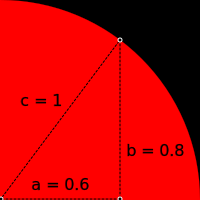

# 🥧 Monte Carlo 💕 π

## ⭐ Introduction

This lab shows how to estimate the mathematical constant **π** (pi) using
a **Monte Carlo algorithm**.

- What do you know about **π**?
- Do you know the **area** of a circle with radius `1`?

## [>] Docs

A **Monte Carlo algorithm** is a computer program that simulates the behavior of
other systems. It's not a method that gives you a perfectly precise answer, but
rather an approximate one, often relying on **randomness** and **statistics**
to reach a result. The more times you run it, the closer you get to the true
answer.

[Next]

## ⭐ Quarter circle


What's the **area** of the red **quarter-circle** if the radius is `1`? Can
you estimate it to the nearest tenth?

What's the total **area** of the **square** (including both the red and black
areas)?

If we place a dot **randomly** within the square, what's the **probability**
it will land inside the red quarter-circle? Does your answer make sense
visually?

### [>] Hint

- **Square Area:** If the width of the square is `1`, its area is `1 * 1 = 1`.

- **Circle Area:** The area of a circle with radius `1` is `r²π` or `r * r * π`,
  so that's `1 * 1 * π = π`.

- **Quarter Circle Area:** The red quarter-circle's area is one-fourth of the
  full circle with radius 1, so it's `π / 4`, which is approximately `0.8`.

- **Probability:** The probability of a random point landing inside the red
  quarter-circle is the ratio of the quarter-circle's area to the square's
  area: `(π / 4) / 1 = π / 4`. This is about `0.8`, which seems visually
  reasonable.

- **Estimating π:** This means if we randomly place many dots within the square,
  assuming a truly random distribution, we should expect roughly
  `(π / 4) * 100` percent of those dots to fall inside the quarter circle. The
  more dots we place, the more precise our estimate of π should become. Let's
  put this theory to the test!

[Next]

## ⭐ Draw a Red Quarter Circle

Modify the code on the right to draw `"red"` dots for points inside the
quarter-circle, just like in the image above.

Use the [`sqrt`] function to calculate the distance from each dot to the
circle's center at `0 0`.

[`sqrt`]: /docs/builtins.html#sqrt

The distance from the circle's center at `0 0` to any point `x y` is calculated
using the Pythagorean theorem `a² + b² = c²`:

```evy
c := sqrt a*a+b*b
```



If this distance is less than or equal to `1`, the point lies within the
quarter-circle and should be colored red. (Remember, we're scaling `x` and `y`
by 100 when positioning the dots, as the Evy canvas is 100 by 100.)

### [>] Hint

Add the following code inside the loop after declaring `x` and `y` and before
drawing the circle.

```evy
d := sqrt x*x+y*y
if d <= 1
    color "red"
else
    color "black"
end
```

[Next]

## ⭐ Estimate π

Can you calculate π by tallying up red dots and black dots?

We know the total number of points is `i`. Let's count the `"red"` dots in the
variable `reds`. We'll then calculate the ratio of `reds / i` and multiply by
`4` to get an estimate of π.

### [>] Hint

At the top of your code, add:

```evy
reds := 0
```

Inside the `if d <= 1` condition, add:

```evy
if d <= 1
  color "red"
  reds = reds + 1
else // ...
```

And at the bottom of the loop, add:

```evy
while // ...
  // ...
  piCalc := reds / i * 4
  cls // clears the text output
  print "Calculated Pi:" piCalc
  print "Builtin Pi:   " pi
end
```
