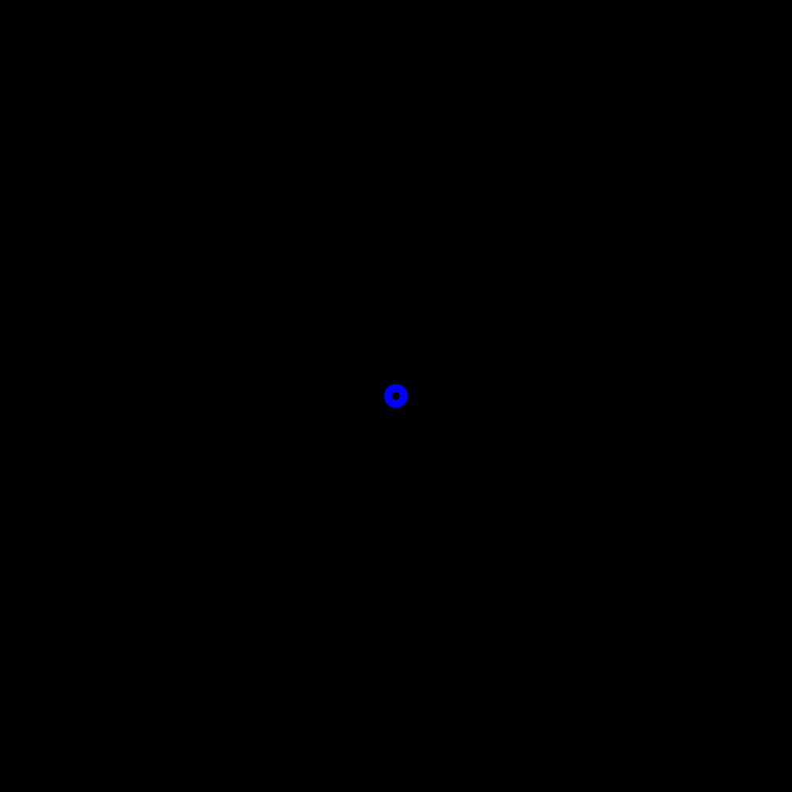
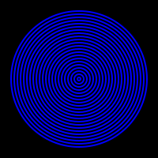

# 🧿 Pulse

## ⭐ 1 Little Blue Circle

Write a program that draws:



- Background: `"black"`
- Outline width: `1`
- Fill color: `"none"`
- Outline color (`stroke`): `"blue"`
- Radius: `1`

### [>] Hint

```evy
clear ❓
width ❓
fill ❓
stroke ❓

move 50 ❓
circle ❓
```

---

## ⭐ Many Circles

Extend your program to draw:



Use a variable `r` for the circle radius, starting at `1`.

Within a loop:

- Draw the circle with radius `r`.
- Increase `r` by `2`.

Keep looping as long as the radius `r` is less than `45`.

### [>] Hint

```evy
r := ❓
while r < ❓
	circle ❓
	r = r +❓
end
```

---

## ⭐ Animate

Add a `sleep` of `0.1` seconds after drawing each circle to create an
animation.

### [>] Demo


### [>] Hint

```evy
while r < __
	circle __
	r = r + __
	sleep ❓
end
```

---

## ⭐ Add Transparency

Add a **nearly transparent black** overlay at the beginning of each loop
iteration to create a fading effect.

Use `clear` with `hsl 0 0 0 15`.

### [>] Demo


### [>] Hint

```evy
while r < __
	clear (hsl ❓)
	circle __
	r = r + __
	sleep __
end
```

---

## ⭐ Tweak for a Smooth Animation

Reduce the

- loop increment
- sleep duration
- alpha value

### [>] Demo


### [>] Hint

- increment: r = r + 0.1
- sleep: 0.001 seconds
- alpha: hsl 0 0 0 1

---

## ⭐ Add the Pulse

Let's make the circle continuously grow and shrink.

**Loop Forever:** Change the loop condition to `true` to create an endless loop.

```evy
while true
    // ...
end
```

**Change Direction:** Instead of always increasing the radius (`r`) by `0.1`,
use a variable `inc` to control the change.

```evy
inc := 0.1  // Amount to increase/decrease the radius
while true
    r = r + inc
end
```

**Reverse the Change:** Inside the loop, check if `r` goes below 1 or above 45.
If it does, flip the sign of `inc` to reverse the animation's direction.

### [>] Hint

```evy
inc := 0.1
while true
    if r < 1 or r > 45
        inc = -inc  // Reverse the increment
    end
    r = r + inc
end
```
