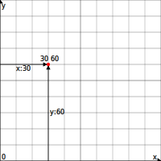

# 🎯 Coordinates

Can you figure out the coordinates?

1. **Run** this program.
2. **Tap** the drawing area (canvas).
3. What are the coordinates of the red dot? 🔴
4. **Tap** the canvas again for a hint and the solution. 🎯

## [>] Source

The source code for this program is hidden, but if you're interested in how it works, you can
take a peek at the <a href="#coords-code" target="_blank">full example</a>.

## [>] Docs

Imagine the canvas as a grid. Each point on this grid is identified by two numbers:

- **x-coordinate**
  How far the point is from the left edge of the canvas.
- **y-coordinate**  
  How far the point is from the bottom edge of the canvas.

You write these coordinates together like this: `x y`.

[Image Source]

[Image Source]: https://play.evy.dev/#content=H4sIAAAAAAAAA2WRQW6DMBBF9z7Fl9cFbIidmG2lXgKxoOAQqwRHhpDQqnevDIaq6mpmnv/M99hJglb32lWjRm2ta4YoY5Fk8TC1eJjxQpIEeprh7j2iaJjayN7H/9I/QE8zqTtdOdDHxYyaktaZhtS2sw70vavqD0oephkvYPGBkM70GgycMXK1k0/ZyjjzKbnZbkaxFCUKdQKPxZr4euVBtEzxMBZQp9KDEDwn6/xsN8gYJNv85W6VMQhVokgVxLFEkfEQFx5EqYL0VukxiI+QvNw48Q836ue4L8rJ2fYjvgbzqfMDztXVdHNO34yr8Gob/YKr7e1wq2pNv8NNlQAnfgrok66IQ4mA5h1tIkZDYyog0wCXJbeDjCNVW3/+yzmDkJtVnnke/svphu7vJhmpjas7DU5+AAOGBlk8AgAA

The Evy canvas ranges from coordinates `0 0` to `100 100`. This means that
the corners of the canvas have the following coordinates:

| Corner       | Coordinates |
| ------------ | ----------- |
| Bottom left  | `0 0`       |
| Bottom right | `100 0`     |
| Top left     | `100 0`     |
| Top right    | `100 100`   |

The center of the canvas has the coordinates <code>50 50</code>. The point <code>30 60</code> is
located 30 units from the left edge of the canvas and 60 units from the bottom edge.
