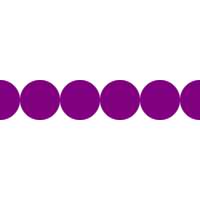

<h1>🟣🚚 Moving Dot</h1>

## ⭐ 6 Circles

Can you draw 6 purple circles at x coordinates `0`, `20`, `40`, `60`, `80`, and
`100`?

### [>] Demo



[Next]

## ⭐ 6 Circles in a Loop

Can you draw these 6 purple circles using a loop?

Loop structure:

```evy
while loop_condition
    loop_body
    // …
end
```

### [>] Hint

```evy
x:num
while x <= ❓
    move x 50
    circle 10
    x = x + ❓
end
```

[Next]

## ⭐ Animation

Can you change the program to make the circle move from left to right, using the
[`clear`] and [`sleep`] commands?

[`clear`]: /docs/builtins.html#clear
[`sleep`]: /docs/builtins.html#sleep

### [>] Demo


### [>] Hint

```evy
while x <= _
   // …
   sleep 0.2
   clear
end
```

[Next]

## ⭐ Animation Smoothing

Can you change the program to make animation smoother?
Reduce the `x` increment and the `sleep` time.

[`clear`]: /docs/builtins.html#clear
[`sleep`]: /docs/builtins.html#sleep

### [>] Demo


### [>] Hint

```evy
while // …
    // …
    x = x + 0.1
    sleep 0.002
    clear
end
```

[Next]

## ⭐ 2 Moving circles

Make 2 circles move in opposite direction.

### [>] Demo


### [>] Hint

```evy
move x 40
circle 10

move 100-x 60
circle 10
```

[Next]

## ⭐ 4 Moving circles

### [>] Demo


### [>] Hint

```evy
move i 60
color "orange"
circle 8

move 100-i 40
color "red"
circle 8

move 40 i
color "purple"
circle 8 // …
```
