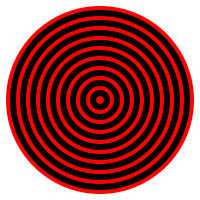

# 🎯 Target board

## ⭐ Draw a target board

Draw a target board with concentric circles.


### [>] Hint

```evy
//...
while r > ❓
    circle r
    r = ❓ - ❓
end
```

[Next]

## ⭐ Animation

Animate the circles with a `sleep` for 0.2 seconds.

### [>] Hint

```evy
//...
while r > ❓
    // ...
    sleep ❓
end
```

[Next]

## ⭐ Tweak

Increase the starting radius to cover the whole canvas.
