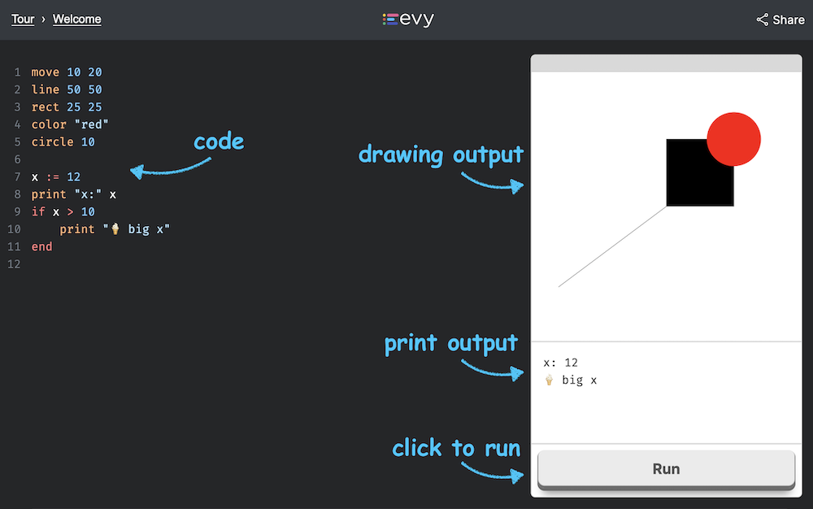

# Evy

Evy is a programming language that helps you learn how to code. It's made for
people who are just starting out, and it has simple rules that make it easy
to understand.

## Evy website

You can try it out on the Evy web [playground], where you can choose from a
variety of examples to get you started. If you have some programming
experience, you may also find the [Syntax by Example] or the
[Language Specification] helpful.

Write your code on the left. Click `Run` to see the output on the right,
including any text or drawings that your code generates.



[playground]: https://play.evy.dev
[Syntax by Example]: https://docs.evy.dev/syntax_by_example.html
[Language Specification]: https://docs.evy.dev/spec.html

## Hello world in Evy

Here's an Evy program that writes `Hello world` to the screen

```evy
print "Hello world"
```
